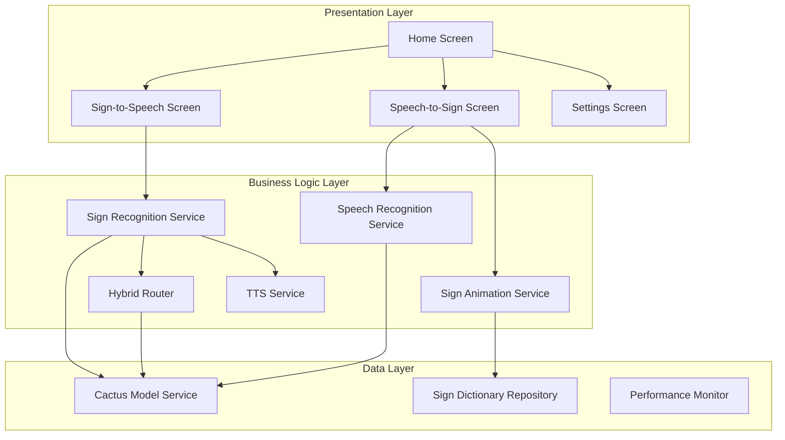

# SignBridge - Comprehensive Implementation Plan

## Project Overview
**Goal**: Build a Flutter Android application for real-time, offline, bidirectional sign language translation using Cactus SDK.

**Timeline**: Full implementation with hybrid routing and comprehensive sign library
**Team**: Experienced Flutter developers with AI/ML background

---

## Architecture Summary



---

## Phase 1: Project Foundation & Setup

### 1.1 Flutter Project Initialization
**Priority**: Critical | **Duration**: 2-3 hours

**Tasks**:
- [ ] Create new Flutter project: `flutter create signbridge`
- [ ] Configure `pubspec.yaml` with all dependencies
- [ ] Setup Android configuration (minSdkVersion 24, targetSdkVersion 34)
- [ ] Configure `AndroidManifest.xml` with required permissions
- [ ] Setup project directory structure as specified
- [ ] Initialize Git repository with `.gitignore`

**Dependencies to Add**:
```yaml
dependencies:
  cactus: ^latest
  camera: ^0.10.5
  flutter_tts: ^3.8.3
  lottie: ^2.7.0
  provider: ^6.1.1
  permission_handler: ^11.0.1
  path_provider: ^2.1.1
  shared_preferences: ^2.2.2
  http: ^1.1.0  # For hybrid cloud calls
```

**Deliverables**:
- ✅ Working Flutter project structure
- ✅ All dependencies resolved
- ✅ Android build configuration complete

**Technical Considerations**:
- Ensure `aaptOptions` prevents model compression
- Set `android:requestLegacyExternalStorage="true"` for model storage
- Configure ProGuard rules to preserve Cactus SDK classes

---

### 1.2 Directory Structure Setup
**Priority**: Critical | **Duration**: 1 hour

**Create Directory Tree**:
```
lib/
├── main.dart
├── config/
│   ├── app_config.dart
│   └── permissions_config.dart
├── core/
│   ├── models/
│   │   ├── sign_gesture.dart
│   │   ├── hand_landmarks.dart
│   │   ├── recognition_result.dart
│   │   └── translation_mode.dart
│   ├── services/
│   │   ├── cactus_model_service.dart
│   │   ├── camera_service.dart
│   │   └── permission_service.dart
│   └── utils/
│       ├── logger.dart
│       └── performance_monitor.dart
├── features/
│   ├── sign_recognition/
│   ├── speech_recognition/
│   ├── sign_animation/
│   ├── text_to_speech/
│   └── hybrid_routing/
├── ui/
│   ├── screens/
│   ├── widgets/
│   └── theme/
└── data/
    ├── repositories/
    └── assets/
```

**Deliverables**:
- ✅ Complete directory structure
- ✅ Placeholder files with basic class definitions

---

## Phase 2: Core Infrastructure & Services

### 2.1 Data Models Implementation
**Priority**: Critical | **Duration**: 3-4 hours

**Files to Create**:

#### `core/models/hand_landmarks.dart`
```dart
class HandLandmarks {
  final List<Point3D> points;  // 21 landmarks (MediaPipe standard)
  final DateTime timestamp;
  
  // Named accessors for key landmarks
  Point3D get wrist => points[0];
  Point3D get thumbTip => points[4];
  Point3D get indexTip => points[8];
  Point3D get middleTip => points[12];
  Point3D get ringTip => points[16];
  Point3D get pinkyTip => points[20];
  
  // Normalization methods
  HandLandmarks normalize();
  List<double> toFeatureVector();
}

class Point3D {
  final double x, y, z;
  Point3D(this.x, this.y, this.z);
  
  double distanceTo(Point3D other);
  Point3D operator -(Point3D other);
}
```

#### `core/models/sign_gesture.dart`
```dart
class SignGesture {
  final String letter;
  final double confidence;
  final DateTime timestamp;
  final HandLandmarks landmarks;
  final Duration processingTime;
  
  bool get isHighConfidence => confidence > 0.75;
}
```

#### `core/models/recognition_result.dart`
```dart
enum ProcessingSource { local, cloud, localFallback }

class RecognitionResult {
  final String? text;
  final double confidence;
  final ProcessingSource source;
  final int latencyMs;
  final Map<String, dynamic>? metadata;
}
```

**Deliverables**:
- ✅ All data models with serialization
- ✅ Unit tests for model methods
- ✅ Documentation for each class

---

### 2.2 Cactus Model Service
**Priority**: Critical | **Duration**: 6-8 hours

**Implementation**: `core/services/cactus_model_service.dart`

**Key Features**:
1. **Singleton Pattern**: Ensure single instance across app
2. **Model Download Management**: Progress tracking, retry logic
3. **Model Initialization**: GPU acceleration, thread optimization
4. **Error Handling**: Graceful degradation if models fail

**Critical Methods**:
```dart
class CactusModelService {
  static final instance = CactusModelService._();
  
  late CactusLM visionModel;    // LFM2-VL-450M
  late CactusLM textModel;      // Qwen3-0.6B
  late CactusSTT speechModel;   // Whisper-Tiny
  
  bool _isInitialized = false;
  
  // Download with progress callback
  Future<void> downloadModels({
    required Function(String model, double progress) onProgress,
  });
  
  // Initialize all models
  Future<void> initialize();
  
  // Check if models are ready
  bool get isReady => _isInitialized;
  
  // Get model info (size, version)
  Future<Map<String, dynamic>> getModelInfo();
}
```

**Technical Challenges**:
- **Model Size**: LFM2-VL is ~450MB, ensure sufficient storage
- **First Launch**: Show progress UI during download
- **Memory Management**: Load/unload models based on active mode
- **GPU Acceleration**: Configure optimal GPU usage

**Deliverables**:
- ✅ Working model download system
- ✅ Model initialization with error handling
- ✅ Progress tracking UI component
- ✅ Model caching mechanism

---

### 2.3 Permission Service
**Priority**: Critical | **Duration**: 2-3 hours

**Implementation**: `core/services/permission_service.dart`

```dart
class PermissionService {
  static Future<bool> requestCameraPermission();
  static Future<bool> requestMicrophonePermission();
  static Future<bool> requestStoragePermission();
  
  static Future<bool> requestAllPermissions() async {
    final camera = await requestCameraPermission();
    final mic = await requestMicrophonePermission();
    final storage = await requestStoragePermission();
    return camera && mic && storage;
  }
  
  static Future<void> openAppSettings();
}
```

**Deliverables**:
- ✅ Permission request flow
- ✅ Permission denied handling
- ✅ Settings redirect functionality

---

### 2.4 Performance Monitor
**Priority**: High | **Duration**: 3-4 hours

**Implementation**: `core/utils/performance_monitor.dart`

**Metrics to Track**:
- Frame processing latency (sign recognition)
- Model inference time
- End-to-end translation time
- Local vs cloud processing ratio
- Memory usage
- Battery impact

```dart
class PerformanceMonitor {
  static final instance = PerformanceMonitor._();
  
  final List<LatencyMeasurement> _measurements = [];
  
  void recordLatency({
    required String operation,
    required Duration duration,
    required ProcessingSource source,
  });
  
  Map<String, dynamic> getStats();
  
  // Export for demo/judging
  String exportMetricsCSV();
  
  // Real-time monitoring
  Stream<PerformanceMetrics> get metricsStream;
}
```

**Deliverables**:
- ✅ Performance tracking system
- ✅ Real-time metrics display widget
- ✅ Export functionality for judges

---

## Phase 3: Sign-to-Speech Implementation

### 3.1 Camera Service
**Priority**: Critical | **Duration**: 4-5 hours

**Implementation**: `core/services/camera_service.dart`

**Features**:
- Camera initialization with optimal resolution
- Frame streaming at 10 FPS (balance performance/battery)
- Image preprocessing for vision model
- Camera lifecycle management

```dart
class CameraService {
  CameraController? _controller;
  bool _isStreaming = false;
  
  Future<void> initialize();
  
  Stream<CameraImage> get frameStream;
  
  Future<void> startStreaming();
  Future<void> stopStreaming();
  
  void dispose();
}
```

**Technical Considerations**:
- Use `ResolutionPreset.high` for better hand detection
- Disable audio for sign-to-speech mode
- Handle camera rotation/orientation
- Implement frame skipping if processing is slow

**Deliverables**:
- ✅ Working camera stream
- ✅ Frame preprocessing pipeline
- ✅ Camera preview widget

---

### 3.2 Sign Recognition Service
**Priority**: Critical | **Duration**: 10-12 hours

**Implementation**: `features/sign_recognition/sign_recognition_service.dart`

**Pipeline Architecture**:
```
Camera Frame → Preprocessing → Hand Detection → 
Landmark Extraction → Gesture Classification → 
Text Mapping → Confidence Scoring → TTS Output
```

**Key Components**:

#### 3.2.1 Hand Landmark Detector
```dart
class HandLandmarkDetector {
  final CactusLM visionModel;
  
  Future<HandLandmarks?> detectLandmarks(CameraImage image) async {
    // Convert CameraImage to format for LFM2-VL
    final inputImage = await _preprocessImage(image);
    
    // Run vision model inference
    final result = await visionModel.generateCompletion(
      messages: [
        ChatMessage(
          content: "Detect hand landmarks in this image. Return 21 3D coordinates.",
          role: "user",
          images: [inputImage],
        ),
      ],
    );
    
    // Parse model output to HandLandmarks
    return _parseLandmarks(result.response);
  }
  
  Future<InputImage> _preprocessImage(CameraImage image);
  HandLandmarks? _parseLandmarks(String modelOutput);
}
```

#### 3.2.2 Gesture Classifier
```dart
class GestureClassifier {
  // ASL alphabet + numbers database
  static const Map<String, List<double>> signDatabase = {
    'A': [/* 63 normalized coordinates */],
    'B': [/* 63 normalized coordinates */],
    // ... 36 total signs
  };
  
  Future<GestureResult> classify(HandLandmarks landmarks) async {
    final normalized = _normalizeLandmarks(landmarks);
    
    // Calculate cosine similarity to each known gesture
    final similarities = <String, double>{};
    for (final entry in signDatabase.entries) {
      similarities[entry.key] = _cosineSimilarity(
        normalized.toFeatureVector(),
        entry.value,
      );
    }
    
    // Return best match if above threshold
    final best = similarities.entries.reduce((a, b) => 
      a.value > b.value ? a : b
    );
    
    return GestureResult(
      letter: best.value > 0.75 ? best.key : null,
      confidence: best.value,
    );
  }
  
  List<double> _normalizeLandmarks(HandLandmarks raw) {
    // 1. Translate to wrist origin
    // 2. Scale to unit size
    // 3. Rotate to canonical orientation
  }
  
  double _cosineSimilarity(List<double> a, List<double> b);
}
```

#### 3.2.3 Sign-to-Text Converter
```dart
class SignToTextConverter {
  final List<String> _buffer = [];
  final int _bufferSize = 5;
  String _currentWord = "";
  
  String convertToText(String? letter) {
    if (letter == null) return _currentWord;
    
    // Stability check: same letter 4/5 frames
    _buffer.add(letter);
    if (_buffer.length > _bufferSize) _buffer.removeAt(0);
    
    final counts = <String, int>{};
    for (final l in _buffer) {
      counts[l] = (counts[l] ?? 0) + 1;
    }
    
    final stable = counts.entries.firstWhere(
      (e) => e.value >= 4,
      orElse: () => MapEntry("", 0),
    );
    
    if (stable.key.isNotEmpty && stable.key != _currentWord.lastChar) {
      _currentWord += stable.key;
      _buffer.clear();
    }
    
    return _currentWord;
  }
  
  void clearWord() => _currentWord = "";
  
  // Optional: Use Qwen3 for word prediction
  Future<List<String>> predictNextLetters(String currentWord);
}
```

**Deliverables**:
- ✅ Complete sign recognition pipeline
- ✅ ASL alphabet (A-Z) + numbers (0-9) database
- ✅ Real-time gesture classification
- ✅ Text assembly with stability filtering
- ✅ Performance: <500ms latency per frame

---

### 3.3 Text-to-Speech Service
**Priority**: High | **Duration**: 2-3 hours

**Implementation**: `features/text_to_speech/tts_service.dart`

```dart
class TTSService {
  final FlutterTts _tts = FlutterTts();
  
  Future<void> initialize() async {
    await _tts.setLanguage("en-US");
    await _tts.setSpeechRate(0.5);
    await _tts.setVolume(1.0);
    await _tts.setPitch(1.0);
  }
  
  Future<void> speakLetter(String letter);
  Future<void> speakWord(String word);
  Future<void> speakSentence(String sentence);
  
  Future<void> stop();
}
```

**Deliverables**:
- ✅ TTS integration
- ✅ Letter-by-letter speech
- ✅ Word completion speech

---

## Phase 4: Speech-to-Sign Implementation

### 4.1 Speech Recognition Service
**Priority**: Critical | **Duration**: 6-8 hours

**Implementation**: `features/speech_recognition/speech_recognition_service.dart`

```dart
class SpeechRecognitionService extends ChangeNotifier {
  final CactusSTT _whisper;
  bool _isListening = false;
  String _transcribedText = "";
  
  Future<void> startListening() async {
    _isListening = true;
    notifyListeners();
    
    try {
      final transcription = await _whisper.transcribe();
      
      if (transcription != null && transcription.text.isNotEmpty) {
        _transcribedText = transcription.text;
        notifyListeners();
      }
    } catch (e) {
      _handleError(e);
    } finally {
      _isListening = false;
      notifyListeners();
    }
  }
  
  void stopListening();
  void clearTranscription();
}
```

**Technical Considerations**:
- Whisper-Tiny is optimized for English
- Handle background noise
- Implement voice activity detection (VAD)
- Support continuous vs push-to-talk modes

**Deliverables**:
- ✅ Whisper integration
- ✅ Real-time transcription
- ✅ Error handling

---

### 4.2 Sign Dictionary Repository
**Priority**: Critical | **Duration**: 8-10 hours

**Implementation**: `data/repositories/sign_dictionary_repository.dart`

**Database Structure**:
```dart
class SignDictionaryRepository {
  // Word-level signs (200-500 common words)
  static const Map<String, SignAnimation> wordSigns = {
    'hello': SignAnimation(
      path: 'assets/animations/hello.json',
      duration: Duration(milliseconds: 1500),
    ),
    'thank': SignAnimation(path: 'assets/animations/thank.json'),
    'you': SignAnimation(path: 'assets/animations/you.json'),
    'help': SignAnimation(path: 'assets/animations/help.json'),
    'please': SignAnimation(path: 'assets/animations/please.json'),
    'sorry': SignAnimation(path: 'assets/animations/sorry.json'),
    'yes': SignAnimation(path: 'assets/animations/yes.json'),
    'no': SignAnimation(path: 'assets/animations/no.json'),
    // ... 200+ common words
  };
  
  // Letter-level signs (A-Z)
  static const Map<String, SignAnimation> letterSigns = {
    'A': SignAnimation(path: 'assets/animations/letters/A.json'),
    'B': SignAnimation(path: 'assets/animations/letters/B.json'),
    // ... all 26 letters
  };
  
  SignAnimation? getWordSign(String word);
  List<SignAnimation> fingerspellWord(String word);
  
  // Search for similar words if exact match not found
  List<String> findSimilarWords(String word);
}
```

**Animation Asset Creation**:
1. **Option 1**: Use Lottie JSON animations
   - Create/source ASL animations
   - Export as Lottie JSON
   - Optimize file sizes

2. **Option 2**: Use GIF/video sequences
   - Record ASL demonstrations
   - Convert to optimized GIFs
   - Ensure consistent sizing

**Priority Words** (Top 100):
- Greetings: hello, hi, goodbye, bye
- Courtesy: please, thank you, sorry, excuse me
- Questions: what, where, when, who, why, how
- Common verbs: go, come, eat, drink, help, want, need
- Common nouns: home, work, school, food, water, bathroom
- Emotions: happy, sad, angry, tired, sick
- Numbers: one through ten
- Time: today, tomorrow, yesterday, now, later

**Deliverables**:
- ✅ Sign dictionary with 200+ words
- ✅ All 26 letter animations
- ✅ Fingerspelling fallback system
- ✅ Animation asset optimization

---

### 4.3 Sign Animation Service
**Priority**: High | **Duration**: 5-6 hours

**Implementation**: `features/sign_animation/sign_animation_service.dart`

```dart
class SignAnimationService extends ChangeNotifier {
  final SignDictionaryRepository _repository;
  String? _currentAnimation;
  bool _isAnimating = false;
  Queue<SignAnimation> _animationQueue = Queue();
  
  Future<void> displaySignsForText(String text) async {
    final words = text.toLowerCase().split(' ');
    
    for (final word in words) {
      // Try word-level sign first
      final wordSign = _repository.getWordSign(word);
      
      if (wordSign != null) {
        await _playAnimation(wordSign);
      } else {
        // Fallback: fingerspell letter-by-letter
        final letterSigns = _repository.fingerspellWord(word);
        for (final letterSign in letterSigns) {
          await _playAnimation(letterSign);
        }
      }
      
      // Pause between words
      await Future.delayed(Duration(milliseconds: 500));
    }
  }
  
  Future<void> _playAnimation(SignAnimation animation) async {
    _isAnimating = true;
    _currentAnimation = animation.path;
    notifyListeners();
    
    await Future.delayed(animation.duration);
    
    _isAnimating = false;
    _currentAnimation = null;
    notifyListeners();
  }
  
  void stopAnimation();
  void clearQueue();
}
```

**Deliverables**:
- ✅ Animation playback system
- ✅ Queue management
- ✅ Smooth transitions between signs

---

## Phase 5: Hybrid Routing & Cloud Integration

### 5.1 Hybrid Router Implementation
**Priority**: Medium | **Duration**: 6-8 hours

**Implementation**: `features/hybrid_routing/hybrid_router.dart`

**Decision Logic**:
```dart
class HybridRouter {
  static const double LOCAL_CONFIDENCE_THRESHOLD = 0.75;
  static const int MAX_CLOUD_LATENCY_MS = 2000;
  
  bool _cloudEnabled = false;
  final PerformanceMonitor _monitor;
  
  Future<RecognitionResult> processGesture(
    HandLandmarks landmarks,
  ) async {
    final startTime = DateTime.now();
    
    // Always try local first
    final localResult = await _processLocal(landmarks);
    
    // Decision tree
    if (_shouldUseLocal(localResult)) {
      return _recordResult(localResult, startTime);
    }
    
    // Try cloud if enabled and local confidence is low
    if (_cloudEnabled) {
      try {
        final cloudResult = await _processCloud(landmarks)
            .timeout(Duration(milliseconds: MAX_CLOUD_LATENCY_MS));
        
        return _recordResult(cloudResult, startTime);
      } catch (e) {
        // Cloud failed: use local result
        return _recordResult(
          localResult.copyWith(source: ProcessingSource.localFallback),
          startTime,
        );
      }
    }
    
    return _recordResult(localResult, startTime);
  }
  
  bool _shouldUseLocal(RecognitionResult result) {
    return result.confidence >= LOCAL_CONFIDENCE_THRESHOLD ||
           !_cloudEnabled ||
           !_hasInternetConnection();
  }
  
  Future<RecognitionResult> _processLocal(HandLandmarks landmarks);
  Future<RecognitionResult> _processCloud(HandLandmarks landmarks);
  
  RecognitionResult _recordResult(
    RecognitionResult result,
    DateTime startTime,
  ) {
    final latency = DateTime.now().difference(startTime);
    _monitor.recordLatency(
      operation: 'gesture_recognition',
      duration: latency,
      source: result.source,
    );
    return result.copyWith(latencyMs: latency.inMilliseconds);
  }
}
```

**Deliverables**:
- ✅ Hybrid routing logic
- ✅ Confidence-based decision making
- ✅ Automatic fallback mechanism
- ✅ Performance tracking

---

### 5.2 Cloud Fallback Service
**Priority**: Medium | **Duration**: 4-5 hours

**Implementation**: `features/hybrid_routing/cloud_fallback_service.dart`

**Cloud API Options**:
1. **Google Cloud Vision API**: Hand landmark detection
2. **OpenAI Vision API**: General image understanding
3. **Custom API**: Deploy your own model

```dart
class CloudFallbackService {
  final http.Client _client;
  final String _apiKey;
  
  Future<RecognitionResult> recognizeGesture(
    HandLandmarks landmarks,
  ) async {
    final response = await _client.post(
      Uri.parse('https://api.example.com/recognize'),
      headers: {
        'Authorization': 'Bearer $_apiKey',
        'Content-Type': 'application/json',
      },
      body: jsonEncode({
        'landmarks': landmarks.toJson(),
      }),
    );
    
    if (response.statusCode == 200) {
      return RecognitionResult.fromJson(jsonDecode(response.body));
    } else {
      throw CloudServiceException('Failed to recognize gesture');
    }
  }
}
```

**Deliverables**:
- ✅ Cloud API integration
- ✅ Error handling
- ✅ Timeout management

---

### 5.3 Privacy Dashboard
**Priority**: Medium | **Duration**: 3-4 hours

**Implementation**: `ui/screens/privacy_dashboard_screen.dart`

**Metrics to Display**:
- Total recognitions: local vs cloud
- Average latency: local vs cloud
- Data sent to cloud (MB)
- Battery impact comparison
- Privacy score (% local processing)

```dart
class PrivacyDashboard extends StatelessWidget {
  Widget build(BuildContext context) {
    final stats = PerformanceMonitor.instance.getStats();
    
    return Scaffold(
      appBar: AppBar(title: Text('Privacy Dashboard')),
      body: ListView(
        children: [
          _buildMetricCard(
            'Local Processing',
            '${stats['localCount']} recognitions',
            '${stats['avgLocalLatency']}ms avg',
          ),
          _buildMetricCard(
            'Cloud Processing',
            '${stats['cloudCount']} recognitions',
            '${stats['avgCloudLatency']}ms avg',
          ),
          _buildPrivacyScore(stats),
          _buildDataUsageChart(stats),
        ],
      ),
    );
  }
}
```

**Deliverables**:
- ✅ Privacy metrics display
- ✅ Visual charts
- ✅ Export functionality

---

## Phase 6: UI/UX Implementation

### 6.1 Home Screen
**Priority**: High | **Duration**: 3-4 hours

**Features**:
- Mode selection (Sign-to-Speech / Speech-to-Sign)
- Settings access
- Model download status
- Quick tutorial/help

**Deliverables**:
- ✅ Clean, intuitive navigation
- ✅ Material Design 3 styling
- ✅ Accessibility features

---

### 6.2 Sign-to-Speech Screen
**Priority**: Critical | **Duration**: 6-8 hours

**Layout**:
```
┌─────────────────────────────┐
│     Camera Preview          │
│  (with hand landmarks)      │
│                             │
│                             │
│                             │
├─────────────────────────────┤
│  Recognized Text: "HELLO"   │
│  Confidence: 92%            │
├─────────────────────────────┤
│  [▶] [⏹] [🗑]              │
└─────────────────────────────┘
```

**Features**:
- Real-time camera preview
- Hand landmark overlay (debug mode)
- Large text display
- Confidence indicator
- Control buttons (start/stop/clear)
- Word history

**Deliverables**:
- ✅ Responsive layout
- ✅ Real-time updates
- ✅ Visual feedback

---

### 6.3 Speech-to-Sign Screen
**Priority**: Critical | **Duration**: 6-8 hours

**Layout**:
```
┌─────────────────────────────┐
│  Transcribed: "Hello world" │
├─────────────────────────────┤
│                             │
│     Sign Avatar             │
│   (animated character)      │
│                             │
│                             │
├─────────────────────────────┤
│        [🎤]                 │
└─────────────────────────────┘
```

**Features**:
- Transcription display
- Large sign animation area
- Microphone button (push-to-talk)
- Animation queue indicator
- Playback controls

**Deliverables**:
- ✅ Smooth animations
- ✅ Clear visual feedback
- ✅ Intuitive controls

---

### 6.4 Settings Screen
**Priority**: Medium | **Duration**: 4-5 hours

**Settings Categories**:

1. **Model Management**
   - Download/update models
   - View model info (size, version)
   - Clear model cache

2. **Hybrid Mode**
   - Enable/disable cloud fallback
   - Set confidence threshold
   - View privacy dashboard

3. **Display**
   - Show debug info (landmarks, confidence)
   - Animation speed
   - Text size

4. **Audio**
   - TTS voice selection
   - Speech rate
   - Volume

5. **About**
   - App version
   - Credits
   - Privacy policy

**Deliverables**:
- ✅ Complete settings UI
- ✅ Persistent preferences
- ✅ Model management tools

---

### 6.5 Reusable Widgets
**Priority**: Medium | **Duration**: 4-5 hours

**Widgets to Create**:

1. **CameraPreviewWidget**: Camera display with overlays
2. **SignAnimationWidget**: Lottie animation player
3. **ConfidenceIndicator**: Visual confidence meter
4. **TranscriptionDisplay**: Scrollable text display
5. **ModeToggleButton**: Switch between modes
6. **ModelDownloadProgress**: Progress bar for downloads
7. **HandLandmarksOverlay**: Debug visualization

**Deliverables**:
- ✅ Reusable widget library
- ✅ Consistent styling
- ✅ Documentation

---

## Phase 7: Performance Optimization & Monitoring

### 7.1 Performance Optimization
**Priority**: High | **Duration**: 6-8 hours

**Optimization Areas**:

1. **Frame Processing**
   - Reduce processing frequency (10 FPS)
   - Skip frames if processing is slow
   - Use isolates for heavy computation

2. **Memory Management**
   - Dispose resources properly
   - Limit buffer sizes
   - Clear caches periodically

3. **Battery Optimization**
   - Reduce camera resolution when possible
   - Throttle processing when battery is low
   - Use GPU efficiently

4. **Model Optimization**
   - Quantize models if needed
   - Use GPU acceleration
   - Batch processing where possible

**Deliverables**:
- ✅ <500ms latency for sign recognition
- ✅ <30% CPU usage
- ✅ <200MB memory footprint
- ✅ Smooth 30 FPS camera preview

---

### 7.2 Performance Monitoring Dashboard
**Priority**: Medium | **Duration**: 3-4 hours

**Real-time Metrics**:
- FPS counter
- Latency graph
- Memory usage
- Battery drain rate
- Local vs cloud ratio

**Deliverables**:
- ✅ Developer dashboard
- ✅ Export metrics for demo
- ✅ Performance alerts

---

## Phase 8: Testing & Quality Assurance

### 8.1 Unit Testing
**Priority**: High | **Duration**: 8-10 hours

**Test Coverage**:
- [ ] Data models (serialization, methods)
- [ ] Gesture classifier (similarity calculations)
- [ ] Sign dictionary (lookup, fallback)
- [ ] Performance monitor (metrics calculation)
- [ ] Hybrid router (decision logic)

**Target**: >80% code coverage

---

### 8.2 Integration Testing
**Priority**: High | **Duration**: 6-8 hours

**Test Scenarios**:
- [ ] Sign-to-speech full pipeline
- [ ] Speech-to-sign full pipeline
- [ ] Hybrid routing with mock cloud
- [ ] Permission handling
- [ ] Model download and initialization

---

### 8.3 Widget Testing
**Priority**: Medium | **Duration**: 4-5 hours

**UI Tests**:
- [ ] Navigation flow
- [ ] Camera preview rendering
- [ ] Animation playback
- [ ] Settings persistence
- [ ] Error dialogs

---

### 8.4 Manual Testing
**Priority**: Critical | **Duration**: 8-10 hours

**Test Cases**:

1. **Sign Recognition**
   - Test all 26 letters
   - Test all 10 numbers
   - Test in different lighting conditions
   - Test with different skin tones
   - Test with different hand sizes

2. **Speech Recognition**
   - Test with clear speech
   - Test with background noise
   - Test with different accents
   - Test with fast/slow speech

3. **Edge Cases**
   - No internet connection
   - Low battery
   - Low storage
   - Camera/microphone denied
   - Model download failure

4. **Performance**
   - Measure latency
   - Check memory usage
   - Monitor battery drain
   - Test on low-end devices

**Deliverables**:
- ✅ Test report with metrics
- ✅ Bug fixes
- ✅ Performance validation

---

## Phase 9: Build & Deployment

### 9.1 APK Build Configuration
**Priority**: Critical | **Duration**: 2-3 hours

**Build Steps**:
```bash
# Clean build
flutter clean
flutter pub get

# Build release APK
flutter build apk --release --split-per-abi

# Build app bundle (optional)
flutter build appbundle --release
```

**Configuration**:
- [ ] Update version in `pubspec.yaml`
- [ ] Configure ProGuard rules
- [ ] Sign APK with release key
- [ ] Optimize APK size

**Deliverables**:
- ✅ Signed release APK
- ✅ APK size <100MB (excluding models)
- ✅ Installation instructions

---

### 9.2 Model Packaging
**Priority**: Critical | **Duration**: 2-3 hours

**Options**:

1. **Download on First Launch** (Recommended)
   - Smaller APK size
   - Always get latest models
   - Requires internet for first use

2. **Bundle with APK**
   - Works offline immediately
   - Larger APK size (~500MB)
   - May hit Play Store limits

**Deliverables**:
- ✅ Model download system
- ✅ Progress UI
- ✅ Offline fallback

---

### 9.3 Testing on Real Devices
**Priority**: Critical | **Duration**: 4-5 hours

**Test Devices**:
- [ ] High-end device (Pixel 7+, Samsung S23+)
- [ ] Mid-range device (Pixel 6a, Samsung A54)
- [ ] Low-end device (budget Android)

**Validation**:
- [ ] Installation successful
- [ ] Models download correctly
- [ ] Camera works properly
- [ ] Performance acceptable
- [ ] No crashes

**Deliverables**:
- ✅ Device compatibility report
- ✅ Performance benchmarks
- ✅ Bug fixes

---

## Phase 10: Documentation & Demo Preparation

### 10.1 Technical Documentation
**Priority**: High | **Duration**: 4-5 hours

**Documents to Create**:

1. **README.md**
   - Project overview
   - Features
   - Installation instructions
   - Usage guide
   - Architecture overview

2. **ARCHITECTURE.md**
   - System design
   - Component descriptions
   - Data flow diagrams
   - Technology stack

3. **API_DOCUMENTATION.md**
   - Service interfaces
   - Model specifications
   - Configuration options

4. **PERFORMANCE_REPORT.md**
   - Latency metrics
   - Memory usage
   - Battery impact
   - Local vs cloud comparison

**Deliverables**:
- ✅ Complete documentation
- ✅ Code comments
- ✅ Architecture diagrams

---

### 10.2 Demo Preparation
**Priority**: Critical | **Duration**: 6-8 hours

**Demo Script**:

1. **Introduction** (1 min)
   - Problem statement
   - Solution overview
   - Technology stack

2. **Sign-to-Speech Demo** (3 min)
   - Show camera interface
   - Sign "HELLO WORLD"
   - Demonstrate real-time recognition
   - Show confidence scores
   - Play audio output

3. **Speech-to-Sign Demo** (3 min)
   - Show microphone interface
   - Speak "Thank you for watching"
   - Show transcription
   - Display sign animations
   - Demonstrate fingerspelling fallback

4. **Hybrid Routing Demo** (2 min)
   - Show privacy dashboard
   - Demonstrate local processing
   - Show cloud fallback (if available)
   - Display performance metrics

5. **Technical Deep Dive** (3 min)
   - Architecture overview
   - Model specifications
   - Performance benchmarks
   - Privacy features

**Demo Assets**:
- [ ] Presentation slides
- [ ] Video recording (backup)
- [ ] Performance charts
- [ ] Architecture diagrams

**Deliverables**:
- ✅ Polished demo
- ✅ Backup materials
- ✅ Q&A preparation

---

### 10.3 Video Demo Creation
**Priority**: High | **Duration**: 3-4 hours

**Video Structure**:
1. Title screen (5 sec)
2. Problem statement (15 sec)
3. Solution overview (20 sec)
4. Sign-to-speech demo (45 sec)
5. Speech-to-sign demo (45 sec)
6. Technical highlights (30 sec)
7. Performance metrics (20 sec)
8. Closing (10 sec)

**Total**: 3 minutes

**Deliverables**:
- ✅ High-quality demo video
- ✅ Subtitles/captions
- ✅ Upload to YouTube/Vimeo

---

## Risk Management

### High-Risk Items

1. **Cactus SDK Integration**
   - **Risk**: SDK may not work as expected
   - **Mitigation**: Test SDK early, have fallback plan
   - **Fallback**: Use TensorFlow Lite models

2. **Model Performance**
   - **Risk**: Models may be too slow on device
   - **Mitigation**: Optimize model size, use GPU
   - **Fallback**: Reduce model complexity

3. **Hand Detection Accuracy**
   - **Risk**: Poor detection in various conditions
   - **Mitigation**: Test in multiple environments
   - **Fallback**: Add manual calibration

4. **Animation Assets**
   - **Risk**: Creating 200+ animations is time-consuming
   - **Mitigation**: Start with top 50 words
   - **Fallback**: Use fingerspelling only

### Medium-Risk Items

1. **Battery Drain**
   - **Risk**: Continuous camera use drains battery
   - **Mitigation**: Optimize processing, add power-saving mode

2. **Storage Space**
   - **Risk**: Models require significant storage
   - **Mitigation**: Download on-demand, compress models

3. **Cloud API Costs**
   - **Risk**: Cloud fallback may be expensive
   - **Mitigation**: Set usage limits, cache results

---

## Success Metrics

### Functional Requirements
- ✅ Recognizes 26 ASL letters with >75% accuracy
- ✅ Recognizes 10 numbers with >75% accuracy
- ✅ Converts speech to text with >90% accuracy
- ✅ Displays sign animations for 200+ words
- ✅ Works completely offline
- ✅ Processes in <500ms latency

### Technical Requirements
- ✅ Uses Cactus SDK (LFM2-VL, Qwen3, Whisper)
- ✅ Built with Flutter
- ✅ Ships as Android APK
- ✅ All AI runs on-device
- ✅ Clean architecture
- ✅ >80% test coverage

### Bonus Features (Track 2)
- ✅ Hybrid routing with confidence-based cloud fallback
- ✅ Privacy dashboard showing local vs cloud usage
- ✅ Performance metrics display
- ✅ Automatic fallback on cloud failure

---

## Timeline Estimate

**Total Duration**: 120-150 hours (3-4 weeks for experienced team)

| Phase | Duration | Priority |
|-------|----------|----------|
| Phase 1: Foundation | 3-4 hours | Critical |
| Phase 2: Core Infrastructure | 14-18 hours | Critical |
| Phase 3: Sign-to-Speech | 18-22 hours | Critical |
| Phase 4: Speech-to-Sign | 19-23 hours | Critical |
| Phase 5: Hybrid Routing | 13-17 hours | Medium |
| Phase 6: UI/UX | 23-29 hours | High |
| Phase 7: Performance | 9-12 hours | High |
| Phase 8: Testing | 26-33 hours | High |
| Phase 9: Build & Deploy | 8-11 hours | Critical |
| Phase 10: Documentation | 13-17 hours | High |

---

## Next Steps

1. **Review this plan** with your team
2. **Assign tasks** to team members based on expertise
3. **Setup development environment** (Flutter, Android Studio, devices)
4. **Create project repository** with initial structure
5. **Begin Phase 1** implementation

---

## Questions for Clarification

Before starting implementation, please confirm:

1. **Cactus SDK Access**: Do you have the Cactus SDK documentation and API keys?
2. **Animation Assets**: Do you have ASL animation assets, or do we need to create/source them?
3. **Cloud API**: Which cloud service should we use for hybrid routing? (Google Vision, OpenAI, custom)
4. **Team Size**: How many developers will work on this project?
5. **Testing Devices**: What Android devices are available for testing?

---

## Conclusion

This implementation plan provides a comprehensive roadmap for building SignBridge with all specified features including hybrid routing and a complete sign library. The modular architecture ensures each component can be developed and tested independently, while the phased approach allows for iterative development and early validation of core features.

The plan prioritizes getting the core bidirectional translation working first (Phases 1-4), then adding advanced features like hybrid routing (Phase 5), before polishing the UI and preparing for demo (Phases 6-10).

**Key Success Factors**:
- Start with solid foundation (models, permissions, services)
- Test early and often on real devices
- Optimize for performance from the beginning
- Create compelling demo materials
- Document everything for judges

Ready to begin implementation! 🚀