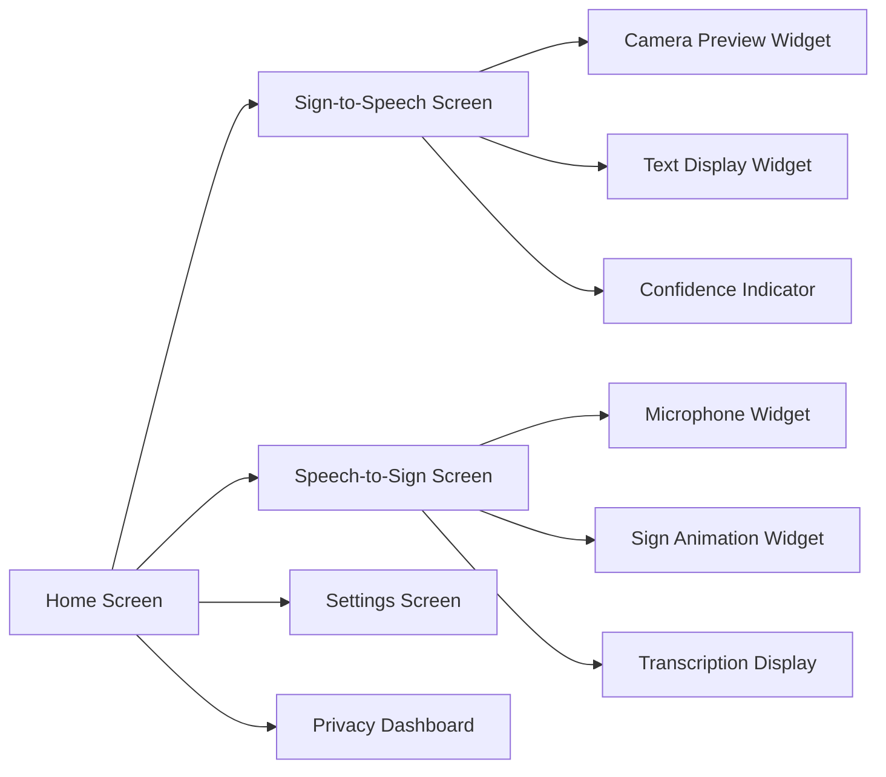
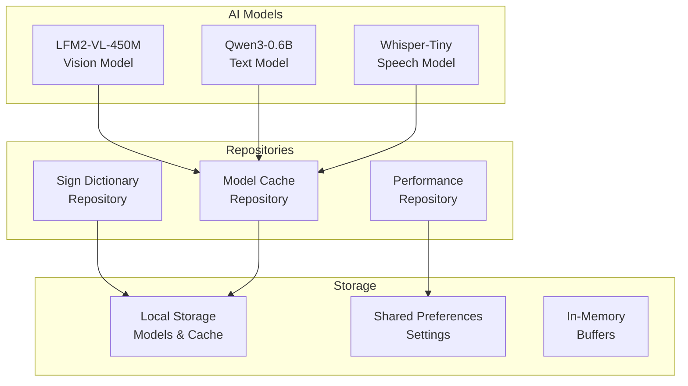
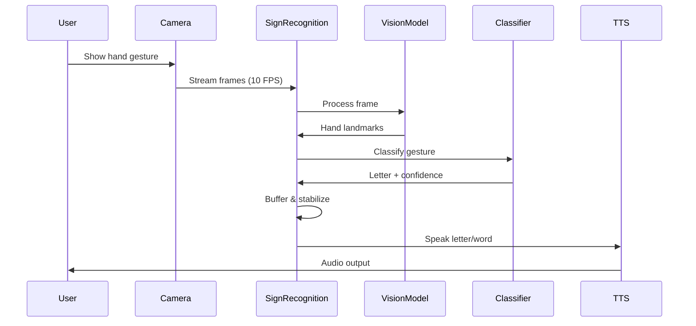
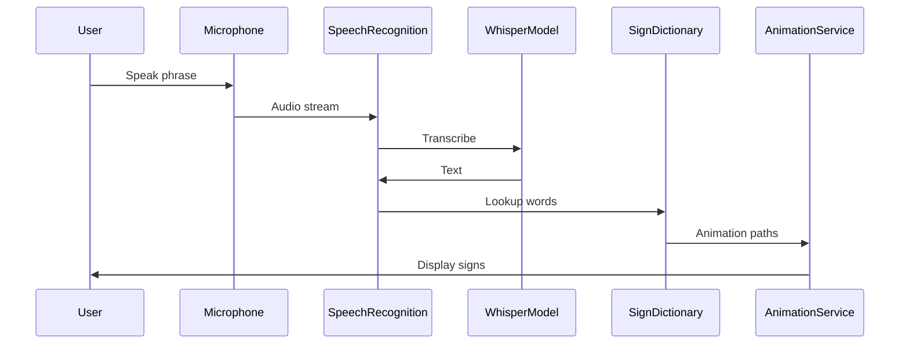
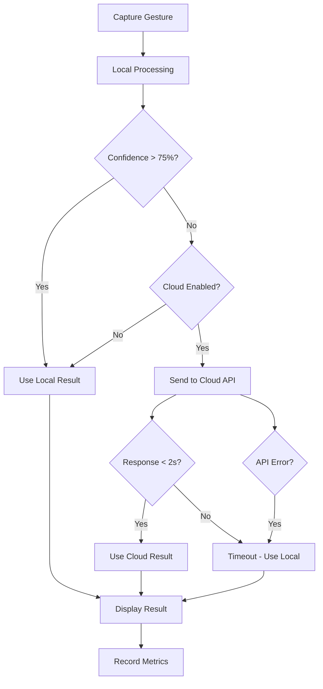

# SignBridge - Technical Architecture Document

## System Overview

SignBridge is a bidirectional sign language translation application that leverages on-device AI models to provide real-time translation between American Sign Language (ASL) and spoken English, with optional cloud-based hybrid routing for improved accuracy.

---

## Architecture Layers

### 1. Presentation Layer
**Responsibility**: User interface and user interaction



**Key Components**:
- **Screens**: Full-page views for different modes
- **Widgets**: Reusable UI components
- **Theme**: Consistent Material Design 3 styling

---

### 2. Business Logic Layer
**Responsibility**: Core application logic and orchestration

```mermaid
graph TB
    subgraph "Sign Recognition Pipeline"
        A[Camera Service] --> B[Frame Processor]
        B --> C[Hand Landmark Detector]
        C --> D[Gesture Classifier]
        D --> E[Sign-to-Text Converter]
        E --> F[TTS Service]
    end
    
    subgraph "Speech Recognition Pipeline"
        G[Microphone Service] --> H[Speech-to-Text]
        H --> I[Text Processor]
        I --> J[Sign Dictionary Lookup]
        J --> K[Animation Service]
    end
    
    subgraph "Hybrid Routing"
        L[Confidence Scorer] --> M{Threshold Met?}
        M -->|Yes| N[Use Local Result]
        M -->|No| O[Try Cloud API]
        O --> P{Success?}
        P -->|Yes| Q[Use Cloud Result]
        P -->|No| N
    end
```



**Services**:
- **SignRecognitionService**: Orchestrates sign-to-speech pipeline
- **SpeechRecognitionService**: Orchestrates speech-to-sign pipeline
- **SignAnimationService**: Manages sign animation playback
- **TTSService**: Text-to-speech output
- **HybridRouter**: Intelligent routing between local and cloud processing

---

### 3. Data Layer
**Responsibility**: Data management, persistence, and AI models



---

## Data Flow Diagrams

### Sign-to-Speech Flow



**Performance Target**: <500ms end-to-end latency

---

### Speech-to-Sign Flow



**Performance Target**: <1000ms from speech end to animation start

---

### Hybrid Routing Flow



---

## Component Specifications

### 1. CactusModelService

**Purpose**: Centralized management of all AI models

**Responsibilities**:
- Download models on first launch
- Initialize models with optimal configuration
- Provide singleton access to models
- Handle model lifecycle (load/unload)
- Monitor model performance

**Key Methods**:
```dart
class CactusModelService {
  // Singleton instance
  static final instance = CactusModelService._();
  
  // Model instances
  late CactusLM visionModel;    // LFM2-VL-450M
  late CactusLM textModel;      // Qwen3-0.6B
  late CactusSTT speechModel;   // Whisper-Tiny
  
  // Lifecycle
  Future<void> initialize();
  Future<void> downloadModels({Function(String, double)? onProgress});
  Future<bool> areModelsReady();
  
  // Model info
  Future<Map<String, dynamic>> getModelInfo();
  Future<int> getTotalModelSize();
}
```

**Configuration**:
- **GPU Acceleration**: Enabled for vision model
- **Thread Count**: 4 threads for optimal performance
- **Memory Limit**: 512MB per model
- **Cache Strategy**: Keep models in memory during active use

---

### 2. SignRecognitionService

**Purpose**: Process camera frames and recognize hand gestures

**Pipeline Stages**:

1. **Frame Capture** (CameraService)
   - Resolution: 1280x720 (high preset)
   - Frame rate: 10 FPS
   - Format: YUV420

2. **Preprocessing**
   - Convert YUV to RGB
   - Resize to model input size (224x224)
   - Normalize pixel values [0, 1]

3. **Hand Detection** (LFM2-VL)
   - Input: RGB image
   - Output: 21 hand landmarks (x, y, z)
   - Confidence threshold: 0.5

4. **Landmark Normalization**
   - Translate to wrist origin
   - Scale to unit size
   - Rotate to canonical orientation

5. **Gesture Classification**
   - Compare to ASL database (36 signs)
   - Calculate cosine similarity
   - Return best match if confidence > 0.75

6. **Text Assembly**
   - Buffer last 5 frames
   - Require 4/5 agreement for stability
   - Append to current word

7. **TTS Output**
   - Speak letter on detection
   - Speak complete word on pause

**State Management**:
```dart
class SignRecognitionService extends ChangeNotifier {
  // State
  bool _isProcessing = false;
  String _recognizedText = "";
  double _confidence = 0.0;
  HandLandmarks? _currentLandmarks;
  
  // Camera
  CameraController? _camera;
  
  // Processing
  Future<void> startRecognition();
  Future<void> stopRecognition();
  Future<void> _processFrame(CameraImage image);
  
  // Getters
  String get recognizedText => _recognizedText;
  double get confidence => _confidence;
  bool get isProcessing => _isProcessing;
}
```

---

### 3. GestureClassifier

**Purpose**: Match hand landmarks to known ASL signs

**Algorithm**:

1. **Feature Extraction**
   - Extract 21 landmarks (63 coordinates)
   - Normalize to scale/rotation invariant
   - Create feature vector

2. **Similarity Calculation**
   - Cosine similarity: `cos(θ) = (A·B) / (||A|| ||B||)`
   - Compare to all 36 signs in database
   - Return best match

3. **Confidence Scoring**
   - Similarity score [0, 1]
   - Threshold: 0.75 for acceptance
   - Lower scores trigger hybrid routing

**ASL Database Structure**:
```dart
static const Map<String, List<double>> signDatabase = {
  'A': [
    // Normalized landmark coordinates (63 values)
    0.0, 0.0, 0.0,  // Wrist
    0.1, 0.2, 0.0,  // Thumb CMC
    // ... 19 more landmarks
  ],
  'B': [...],
  // ... 34 more signs
};
```

**Optimization**:
- Pre-compute database norms
- Use SIMD operations for dot products
- Cache recent classifications

---

### 4. SignDictionaryRepository

**Purpose**: Map words to sign animations

**Data Structure**:
```dart
class SignAnimation {
  final String path;
  final Duration duration;
  final SignType type;  // word, letter, phrase
  
  SignAnimation({
    required this.path,
    required this.duration,
    this.type = SignType.word,
  });
}

class SignDictionaryRepository {
  // Word-level signs (200-500 words)
  static const Map<String, SignAnimation> wordSigns = {...};
  
  // Letter-level signs (A-Z)
  static const Map<String, SignAnimation> letterSigns = {...};
  
  // Lookup methods
  SignAnimation? getWordSign(String word);
  List<SignAnimation> fingerspellWord(String word);
  bool hasSign(String word);
}
```

**Priority Word Categories**:
1. **Greetings** (10 words): hello, hi, goodbye, bye, welcome, etc.
2. **Courtesy** (15 words): please, thank you, sorry, excuse me, etc.
3. **Questions** (20 words): what, where, when, who, why, how, etc.
4. **Common Verbs** (30 words): go, come, eat, drink, help, want, need, etc.
5. **Common Nouns** (40 words): home, work, school, food, water, etc.
6. **Emotions** (15 words): happy, sad, angry, tired, sick, etc.
7. **Numbers** (20 words): one through twenty
8. **Time** (10 words): today, tomorrow, yesterday, now, later, etc.
9. **Directions** (10 words): left, right, up, down, here, there, etc.
10. **Family** (10 words): mother, father, sister, brother, etc.

**Total**: 180 word-level signs + 26 letters = 206 animations

---

### 5. HybridRouter

**Purpose**: Intelligently route between local and cloud processing

**Decision Logic**:

```dart
class HybridRouter {
  static const double LOCAL_CONFIDENCE_THRESHOLD = 0.75;
  static const int MAX_CLOUD_LATENCY_MS = 2000;
  
  Future<RecognitionResult> processGesture(
    HandLandmarks landmarks,
  ) async {
    // Step 1: Try local processing
    final localResult = await _processLocal(landmarks);
    
    // Step 2: Check if local result is acceptable
    if (_shouldUseLocal(localResult)) {
      return localResult;
    }
    
    // Step 3: Try cloud if enabled
    if (_cloudEnabled && _hasInternet()) {
      try {
        final cloudResult = await _processCloud(landmarks)
            .timeout(Duration(milliseconds: MAX_CLOUD_LATENCY_MS));
        return cloudResult;
      } catch (e) {
        // Cloud failed: fallback to local
        return localResult.copyWith(
          source: ProcessingSource.localFallback,
        );
      }
    }
    
    // Step 4: Use local result
    return localResult;
  }
  
  bool _shouldUseLocal(RecognitionResult result) {
    return result.confidence >= LOCAL_CONFIDENCE_THRESHOLD ||
           !_cloudEnabled ||
           !_hasInternet();
  }
}
```

**Metrics Tracked**:
- Local processing count
- Cloud processing count
- Fallback count
- Average latency (local vs cloud)
- Confidence distribution
- Data sent to cloud (MB)

---

## Performance Specifications

### Latency Targets

| Operation | Target | Maximum |
|-----------|--------|---------|
| Frame processing | <100ms | <200ms |
| Hand detection | <150ms | <300ms |
| Gesture classification | <50ms | <100ms |
| Text-to-speech | <100ms | <200ms |
| **Total (Sign-to-Speech)** | **<400ms** | **<500ms** |
| Speech-to-text | <500ms | <1000ms |
| Sign animation lookup | <50ms | <100ms |
| Animation playback | 1500ms | 2000ms |
| **Total (Speech-to-Sign)** | **<2000ms** | **<3000ms** |

### Resource Constraints

| Resource | Target | Maximum |
|----------|--------|---------|
| CPU usage | <30% | <50% |
| Memory usage | <150MB | <200MB |
| Battery drain | <5%/hour | <10%/hour |
| Storage (app) | <50MB | <100MB |
| Storage (models) | <500MB | <1GB |

### Accuracy Targets

| Metric | Target | Minimum |
|--------|--------|---------|
| Sign recognition accuracy | >85% | >75% |
| Speech recognition accuracy | >95% | >90% |
| False positive rate | <10% | <15% |
| False negative rate | <10% | <15% |

---

## Security & Privacy

### Data Privacy Principles

1. **Local-First Processing**
   - All AI processing happens on-device by default
   - No data sent to cloud unless explicitly enabled
   - User controls hybrid mode toggle

2. **Minimal Data Collection**
   - No user identification
   - No persistent storage of gestures/speech
   - Only performance metrics stored locally

3. **Transparent Cloud Usage**
   - Privacy dashboard shows local vs cloud ratio
   - User notified when cloud is used
   - Option to disable cloud completely

4. **Secure Communication**
   - HTTPS for all cloud API calls
   - API keys stored securely
   - No sensitive data in logs

### Permissions Required

| Permission | Purpose | Required |
|------------|---------|----------|
| CAMERA | Capture hand gestures | Yes |
| RECORD_AUDIO | Capture speech | Yes |
| INTERNET | Cloud fallback (optional) | No |
| WRITE_EXTERNAL_STORAGE | Store models | Yes |

---

## Error Handling Strategy

### Error Categories

1. **Initialization Errors**
   - Model download failure
   - Insufficient storage
   - Permission denied
   - **Action**: Show error dialog, retry option

2. **Runtime Errors**
   - Camera failure
   - Microphone failure
   - Model inference error
   - **Action**: Log error, continue processing

3. **Network Errors**
   - Cloud API timeout
   - No internet connection
   - API rate limit
   - **Action**: Fallback to local, notify user

4. **Resource Errors**
   - Out of memory
   - Low battery
   - Thermal throttling
   - **Action**: Reduce processing rate, notify user

### Error Recovery

```dart
class ErrorHandler {
  static Future<void> handleError(
    Exception error,
    ErrorContext context,
  ) async {
    // Log error
    Logger.error(error, context);
    
    // Determine recovery strategy
    switch (error.runtimeType) {
      case CameraException:
        await _handleCameraError(error as CameraException);
        break;
      case ModelException:
        await _handleModelError(error as ModelException);
        break;
      case NetworkException:
        await _handleNetworkError(error as NetworkException);
        break;
      default:
        await _handleGenericError(error);
    }
  }
}
```

---

## Testing Strategy

### Unit Tests

**Coverage Target**: >80%

**Test Categories**:
1. **Data Models**
   - Serialization/deserialization
   - Validation logic
   - Equality comparisons

2. **Algorithms**
   - Landmark normalization
   - Cosine similarity calculation
   - Confidence scoring

3. **Services**
   - Model initialization
   - Permission handling
   - Performance monitoring

### Integration Tests

**Test Scenarios**:
1. **Sign-to-Speech Pipeline**
   - Mock camera frames
   - Verify text output
   - Check latency

2. **Speech-to-Sign Pipeline**
   - Mock audio input
   - Verify animation selection
   - Check timing

3. **Hybrid Routing**
   - Mock local/cloud results
   - Verify decision logic
   - Check fallback behavior

### Widget Tests

**UI Components**:
1. Camera preview rendering
2. Animation playback
3. Text display updates
4. Settings persistence
5. Navigation flow

### Manual Testing

**Test Matrix**:

| Condition | Sign-to-Speech | Speech-to-Sign |
|-----------|----------------|----------------|
| Bright light | ✓ | ✓ |
| Dim light | ✓ | ✓ |
| Different skin tones | ✓ | N/A |
| Background noise | N/A | ✓ |
| Different accents | N/A | ✓ |
| Offline mode | ✓ | ✓ |
| Low battery | ✓ | ✓ |

---

## Deployment Configuration

### Build Variants

1. **Debug Build**
   - Debug logging enabled
   - Performance overlay
   - Test data included

2. **Release Build**
   - Optimized code
   - Minimal logging
   - ProGuard enabled

### APK Configuration

```gradle
android {
    compileSdkVersion 34
    
    defaultConfig {
        applicationId "com.signbridge.app"
        minSdkVersion 24
        targetSdkVersion 34
        versionCode 1
        versionName "1.0.0"
        
        // Prevent model compression
        aaptOptions {
            noCompress "tflite"
            noCompress "onnx"
        }
    }
    
    buildTypes {
        release {
            minifyEnabled true
            shrinkResources true
            proguardFiles getDefaultProguardFile('proguard-android-optimize.txt'),
                         'proguard-rules.pro'
        }
    }
    
    // Split APKs by ABI for smaller downloads
    splits {
        abi {
            enable true
            reset()
            include 'armeabi-v7a', 'arm64-v8a', 'x86', 'x86_64'
            universalApk false
        }
    }
}
```

### ProGuard Rules

```proguard
# Keep Cactus SDK classes
-keep class com.cactus.** { *; }
-keepclassmembers class com.cactus.** { *; }

# Keep model classes
-keep class org.tensorflow.** { *; }
-keep class org.pytorch.** { *; }

# Keep Flutter classes
-keep class io.flutter.** { *; }
```

---

## Monitoring & Analytics

### Performance Metrics

**Tracked Metrics**:
1. **Latency**
   - Frame processing time
   - Model inference time
   - End-to-end translation time

2. **Accuracy**
   - Recognition success rate
   - Confidence distribution
   - Error rate

3. **Resource Usage**
   - CPU utilization
   - Memory consumption
   - Battery drain rate

4. **User Behavior**
   - Mode usage (sign-to-speech vs speech-to-sign)
   - Session duration
   - Feature usage

### Dashboard Display

```dart
class PerformanceDashboard extends StatelessWidget {
  Widget build(BuildContext context) {
    final stats = PerformanceMonitor.instance.getStats();
    
    return Column(
      children: [
        MetricCard(
          title: 'Average Latency',
          value: '${stats['avgLatency']}ms',
          target: '<500ms',
        ),
        MetricCard(
          title: 'Recognition Accuracy',
          value: '${stats['accuracy']}%',
          target: '>85%',
        ),
        MetricCard(
          title: 'Local Processing',
          value: '${stats['localRatio']}%',
          target: '>90%',
        ),
        LatencyChart(data: stats['latencyHistory']),
      ],
    );
  }
}
```

---

## Future Enhancements

### Phase 2 Features

1. **Multi-Language Support**
   - Support for BSL (British Sign Language)
   - Support for other sign languages
   - Language selection in settings

2. **Advanced Gestures**
   - Two-handed signs
   - Dynamic gestures (motion-based)
   - Facial expressions

3. **Conversation Mode**
   - Multi-turn conversations
   - Context awareness
   - Conversation history

4. **Offline Improvements**
   - Smaller model variants
   - Model quantization
   - Faster inference

5. **Social Features**
   - Share translations
   - Practice mode
   - Learning resources

### Technical Debt

1. **Code Quality**
   - Increase test coverage to >90%
   - Add more comprehensive error handling
   - Improve documentation

2. **Performance**
   - Optimize model loading time
   - Reduce memory footprint
   - Improve battery efficiency

3. **UX**
   - Add onboarding tutorial
   - Improve accessibility
   - Add haptic feedback

---

## Conclusion

This technical architecture provides a solid foundation for building SignBridge with:

- **Modularity**: Clear separation of concerns
- **Scalability**: Easy to add new features
- **Performance**: Optimized for real-time processing
- **Privacy**: Local-first with optional cloud
- **Testability**: Comprehensive testing strategy

The architecture prioritizes user privacy, performance, and accuracy while maintaining flexibility for future enhancements.